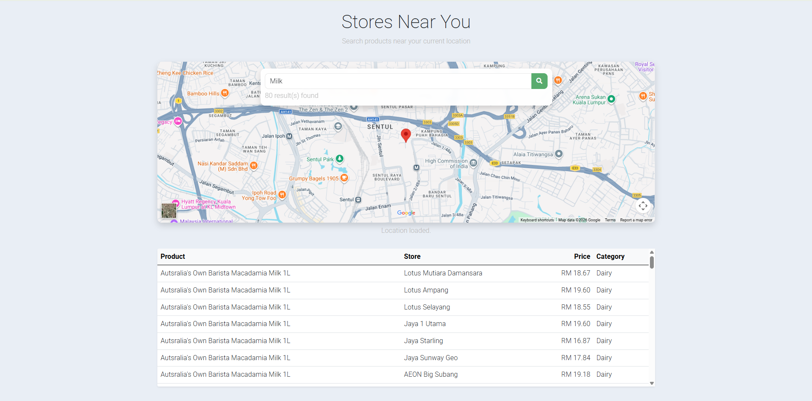
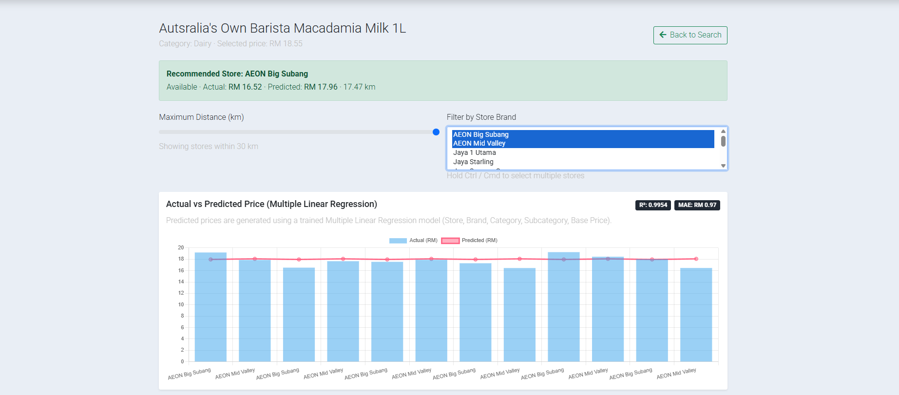
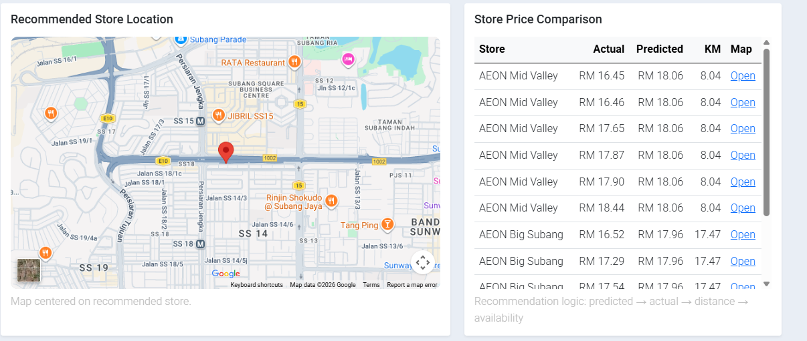
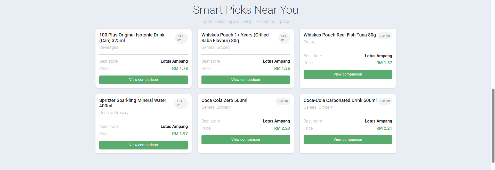

# 🛒 WasGud
### A Location-Based Retail Intelligence Platform for Grocery Price Comparison


---

## 📖 Overview

**WasGud** is a final-year capstone project developed for the **Bachelor of Business Analytics** at **Sunway University**.

The objective of this project is to help consumers make informed purchasing decisions by allowing them to compare grocery prices across multiple supermarkets without visiting each store individually.

The platform aggregates pricing information collected through web scraping and displays nearby stores using Google Maps, enabling users to locate products based on both **price** and **proximity**.

Although the current implementation focuses on grocery retailers, the system was designed as the foundation for a future community-powered retail intelligence platform.

---

## 🎯 Problem Statement

Consumers often need to visit multiple supermarkets or browse several websites to compare product prices.

This process is:
- Time-consuming
- Inefficient
- Lacks location awareness
- Makes it difficult to identify the best value nearby

WasGud aims to solve this by centralizing product pricing information into a single platform.

---

## ✨ Features

- 🔍 Search grocery products
- 📍 Find nearby supermarkets using Google Maps
- 💰 Compare product prices across retailers
- 🗂 Product categorization
- ➕ Create, Read, Update and Delete (CRUD) product records
- 🌐 Responsive web interface

---

## 🛠 Technology Stack

### Frontend
- HTML5
- CSS3
- JavaScript

### Backend & Data Processing
- Python
- Pandas

### Web Scraping
- Scrapy
- Selenium

### Database
- Excel Spreadsheet (Prototype Database)

### APIs
- Google Maps API

### Deployment
- Netlify
- GoDaddy Domain

---

## 🏗 System Architecture

```
Retail Websites
        │
        ▼
Scrapy + Selenium
        │
        ▼
Data Cleaning (Pandas)
        │
        ▼
Product Database
        │
        ▼
Search Engine
        │
        ├────────► Google Maps API
        │
        ▼
Frontend (HTML/CSS/JavaScript)
        │
        ▼
        User
```

---

## 📊 Data Pipeline

1. Collect product information from supermarket websites.
2. Scrape product names, prices and categories.
3. Clean and standardize data using Pandas.
4. Store processed data in a structured database.
5. Retrieve matching products through the search function.
6. Display nearby supermarkets using Google Maps.

---

## 🏪 Retailers Included

The prototype dataset was collected from selected Malaysian grocery retailers including:

- Jaya Grocer
- Lotus's
- NSK Grocer
- AEON

---

## 💡 Skills Demonstrated

This project demonstrates experience in:

- Python Programming
- Web Scraping
- Data Cleaning
- Data Processing
- Frontend Web Development
- API Integration
- Geospatial Applications
- Business Analytics
- Data-Driven Problem Solving

---

## 📸 Screenshots#

### 🔍 Product Search



### 💰 Price Comparison



### 📍 Recommended Stores



### ⭐ Smart Picks



## 🚀 Future Improvements (WasGud 2.0)

Planned enhancements include:

- Community-submitted real-time price updates
- AI-powered receipt scanning
- Personal spending tracker
- Promotion alerts
- User accounts
- Product reviews
- Crowdsourced price validation
- Mobile application
- Support for pharmacies, hardware stores, F&B, and apparel retailers

---

## 📚 Lessons Learned

Throughout this project I gained practical experience in:

- Building an end-to-end analytics application
- Working with real-world retail data
- Integrating web scraping with frontend applications
- Solving business problems through technology
- Designing scalable product concepts

---

## 👨‍💻 Author

**Abdul Fattah Firdaus bin Morshidi**

Bachelor of Business Analytics  
Sunway University

GitHub: https://github.com/fattah2905


---

## 📄 License

This project is intended for educational and portfolio purposes.

```
